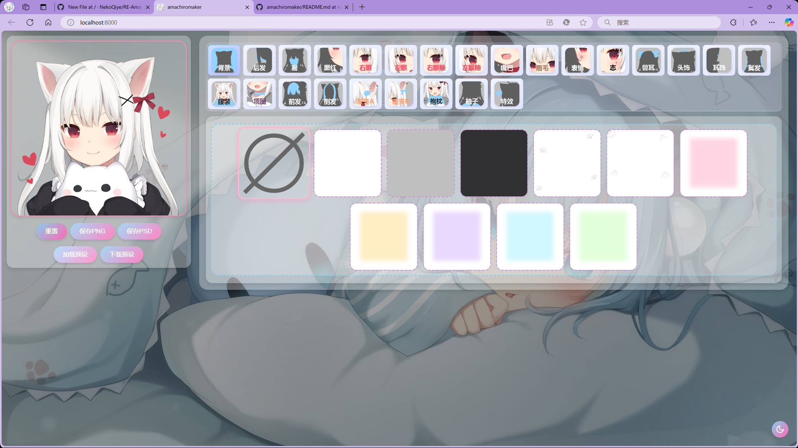

# RE-Amachiromaker

这个项目复活了被甘城猫猫下线的捏脸网站喵~

本项目基于Charlie Chiangm的Amachiromaker进行了UI大修喵~

# 特点

1.为所有的元素添加了交互动画喵；

2.修改原版简陋的UI界面，让网页更美观；

3.为所有的选项卡添加了一看就懂缩略图喵；

4.添加了深色模式，white.jpg为白天背景，black.jpg为夜晚背景喵~

# 如何构建

-下载所有的文件并解压到一个文件夹内；

-安装python；

-运行“python -m http.server 8000 --directory <项目根目录>”

-访问 localhost:8000 就可以啦~

# 特别说明

因为版权原因，本存储库不包含任何原项目的图像哦，抱歉呢

####如果你喜欢这个项目，不要忘了加个star呐~

  <figure>
    
    <figcaption>Fig.1 - Screenshot</figcaption>
  </figure>
  <figure>
    
    <figcaption>Fig.2 - Animated GIF</figcaption>
  </figure>
  <figure>
    
    <figcaption>Fig.3 - PSD Layers</figcaption>
  </figure>
  
Any of the artwork above will <b><i>not</i></b> be provided in this repository.

  
Copyright of the artwork belongs to the original author.

